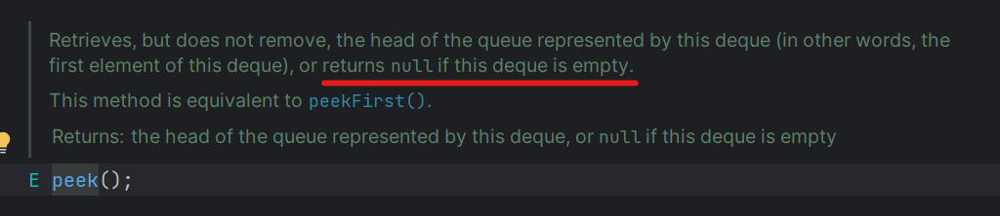
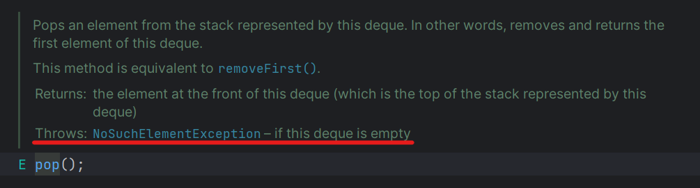
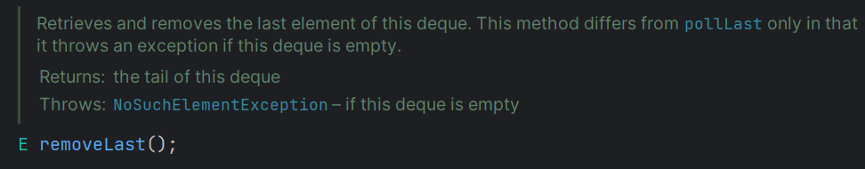

# 자바 스택,큐 관련 문법 정리
- [Stack](#stack)
    - [스택을 구현한 클래스](#스택을-구현한-클래스)
    - [peek() 또는 pop()을 사용할 때 주의할 점](#peek-또는-pop을-사용할-때-주의할-점)
    - [removeLast()와 pollLast()의 차이](#removelast와-polllast의-차이)
      - [Stack에 있는 내용을 저장된 순서대로 문자열로 변환하기](#stack에-있는-내용을-저장된-순서대로-문자열로-변환하기)

## Stack
### 스택을 구현한 클래스
스택을 구현한 클래스로 `Stack`이 존재하지만 이는 과거의 `Vector` 클래스를 기반으로 구현된 것이다.
과거 싱글 코어 시절에 사용되던 자료구조로 동시성이 보장되지 않는다. 따라서 `Stack`과 `Vector` 둘 다
사용하면 안된다. **Stack을 사용하려면 `Deque` 인터페이스를 구현한 `ArrayDeque`를 사용한다.**

### peek() 또는 pop()을 사용할 때 주의할 점
```java
for (char c : s.toCharArray()) {
            count.put(c, count.get(c) - 1);
            if (seen.get(c) != null && seen.get(c)) { // NPE 예외처리
                continue;
            }
            while (!stack.isEmpty() && stack.peek() > c && count.get(stack.peek()) > 0) { // NPE 예외처리
                seen.put(stack.pop(), false);
            }
            stack.push(c);
            seen.put(c, true);
        }

```
다음 코드에서 while문에 해당하는 부분을 잘 살펴보자.
스택에 가장 마지막으로 저장된 값을 조회하는 `peek()`와 실제로 추출하는 `pop()`이 사용되었다.
그런데 만약, 스택이 비어있다면? 어떻게 될까




`peek()`의 경우, `null`을 반환하고 `pop()`의 경우, `NoSuchElementException`을 발생한다.
따라서 해당 메서드들을 사용할 경우, 반드시 스택이 비어있지 않은지 확인해야 한다. (if문 또는 while문의 조건부에는
`Boolean` 타입이 와야하기 때문이다. 그렇지 않으면 컴파일 에러가 발생한다.)

따라서 조건문에 `!stack.isEmpty()`가 같이 쓰인 것이다.

```java
for (int i = 0; i < temperatures.length; i++) {
    while (!stack.isEmpty() && temperatures[i] > temperatures[stack.peek()]) {
        int index = stack.pop();
        answer[index] = i - index;
    }
    stack.push(i);
}
```
다음 코드도 마찬가지이다. 스택이 비어있는지 확인하는 코드가 없을 경우, 컴파일 에러가 발생한다.

이처럼 조건문에 특정 로직에 대한 조건 이외에 비어있는지 확인하는 코드가 있을 때, 그 이유(컴파일 에러 방지)에 대해 이해해봐야 한다.

### removeLast()와 pollLast()의 차이



`removeLast()`와 `pollLast()` 둘 다 스택(정확히는 덱)의 마지막 요소부터 제거하는 메서드이다.
여기서 마지막 요소란, 스택에서 가장 먼저 삽입되어 맨 밑에 깔리는 요소를 뜻한다.

`removeLast()`는 스택이 비어있을 경우, `NoSuchElementException`이 발생하지만 `pollLast()`는 null을 반환한다.

```java
while (!stack.isEmpty()) {
    sb.append(stack.pollLast());
}
```
물론 다음과 같이 조건부를 걸어놓을 경우, `pollLast()`나 `removeLast()` 둘 중 아무거나 사용해도 된다.

### Stack에 있는 내용을 저장된 순서대로 문자열로 변환하기
```java
StringBuilder sb = new StringBuilder();
while (!stack.isEmpty()) {
    sb.append(stack.pollLast());
}
return sb.toString();
```
스택에 저장된 값을 FIFO 형식으로 추출하여 문자열로 만들고 싶을 경우, 다음과 같이
- `StringBuilder`
- `pollLast()` 또는 `removeLast()`(스택이 비어있지 않은지 조건부 사용)
- `toString()` : 문자열 변환

를 사용한다.
