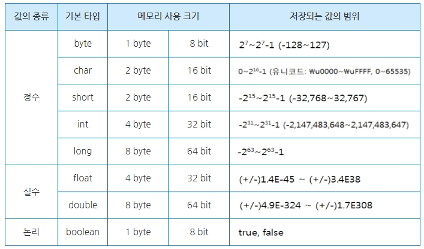

# 자바 코딩테스트 관련 이론 지식 정리
- [원시 자료형 vs 참조 자료형](#원시-자료형-vs-참조-자료형)
  - 속도 비교
  - 각 언어별 지원 자료형(C, 파이썬, 자바, 코틀린)
- [자바 컬렉션 프레임워크]
  - List
  - Map
  - 쓰지 말아야 할 컬렉션
    - 초기 자료형의 성능 문제

## 원시 자료형 vs 참조 자료형
자바의 자료형은 크게 **원시 자료형과 참조 자료형으로 나눌 수 있다.** 원시 자료형은 C언어에서 다룬
자료형과 매우 유사하며, 이름 또한 익숙하다.

> int형 4byte에서 2^31-1까지 표현할 수 있는 이유는 32비트(4바이트)에서 맨 앞 1비트를 부호 표시용으로
> 사용하기 때문에 값을 표현하는 데에는 31비트 밖에 사용하지 못하기 때문이다. 다른 자료형도 원리는 같다.

**원시 자료형의 경우, 타입별로 고정된 크기의 메모리를 할당받는다.** `int a = 7`일 경우, 메모리 특정 영역에
4바이트를 할당하고, 거기엔 `00000000 00000000 00000000 00000111`이라는 이진수 값이 채워진다.

**참조 자료형의 경우, 원시 자료형과는 사뭇 다른 특징들을 갖고 있다.**
1. 참조 자료형은 원시 자료형에 비해 **메모리 모델에서 속도가 느린 영역에 할당된다.**
   (참조 자료형은 메모리에 주소 값이 저장되기 때문에 실제 값을 참조하기 위해서는 두 번 이동을 해야하는 꼴이므로 당연히 원시 자료형보다 느릴 것이다.)
2. 참조 자료형은 원시 자료형에 비해 일정한 크기의 메모리를 할당받는다. **원시 자료형의 경우, 각 타입별로
할당받는 메모리 크기가 제각각이다. 하지만 참조 자료형은 어떠한 값을 할당하더라도 고정된 크기의 메모리를 갖게 되는데
이는 원시 자료형보다 훨씬 크다. (대부분 16바이트를 할당받는다.)** 
3. 참조 자료형은 다양한 메소드를 갖고 있기에 이들을 활용하여 여러 편리한 작업을 수행할 수 있다.
4. 참조 자료형은 Null 값을 가질 수 있다. (원시 자료형은 값이 항상 존재해야 한다. `char`처럼 공백이라도 가져야 한다.)
5. 컬렉션에 저장될 수 있는 요소는 **반드시 참조 자료형만 가능하다.**
6. 원시 자료형을 선언하는 코드는 소문자로 시작하며, 참조 자료형은 대문자로 시작한다. (`int` vs `Integer`)

### 속도 비교
1억 개의 엘리멘트 중 맨 마지막 요소의 값을 조회하는 코드에 대한 성능 테스트를 진행했을 때,
`int[]`를 사용했을 경우, 삽입에 **128밀리초**, 조회에 **26밀리초**가 소요되었다.
반면에 `Integer[]`를 사용했을 경우, 삽입에 **847밀리초**, 조회에 **40밀리초**가 소요되었다.

코딩테스트에서는 원시 자료형과 참조 자료형을 상황에 맞게 적절히 사용할 줄 알아야 최적화 된 코드를
작성할 수 있다. 따라서 이들의 차이점을 간단하게라도 알고 가는 것이 중요하다!

참조 자료형은 원시 자료형에 비해 메모리 공간도 많이 차지한다는 점을 염두에 두어야한다.
특히, `boolean`의 경우, 1 바이트를 할당받지만 래퍼 클래스인 `Boolean`은 128 비트(16바이트)나
할당받게 되므로 훨씬 낭비됨을 알 수 있다.
> boolean이 1비트(0 또는 1만 표현)가 아니라 1바이트를 할당받는 이유 중 하나는 컴퓨터가 값을 표현하는 최소 단위가
> 바이트이기 때문이다.

